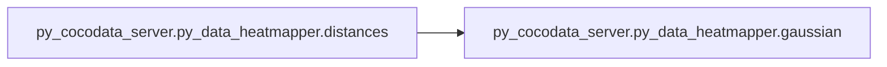
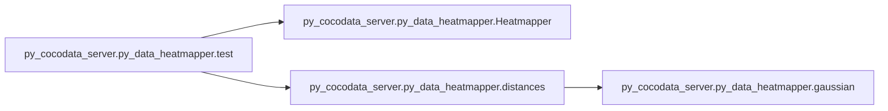

# Py Cocodata Server Py Data Heatmapper

[_Documentation generated by Documatic_](https://www.documatic.com)

<!---Documatic-section-Codebase Structure-start--->
## Codebase Structure

<!---Documatic-block-system_architecture-start--->
```mermaid
None
```
<!---Documatic-block-system_architecture-end--->

# #
<!---Documatic-section-Codebase Structure-end--->

<!---Documatic-section-py_cocodata_server.py_data_heatmapper.gaussian-start--->
## py_cocodata_server.py_data_heatmapper.gaussian

<!---Documatic-section-gaussian-start--->
<!---Documatic-block-py_cocodata_server.py_data_heatmapper.gaussian-start--->
<details>
	<summary><code>py_cocodata_server.py_data_heatmapper.gaussian</code> code snippet</summary>

```python
def gaussian(sigma, x, u):
    double_sigma2 = 2 * sigma ** 2
    y = np.exp(-(x - u) ** 2 / double_sigma2)
    return y
```
</details>
<!---Documatic-block-py_cocodata_server.py_data_heatmapper.gaussian-end--->
<!---Documatic-section-gaussian-end--->

# #
<!---Documatic-section-py_cocodata_server.py_data_heatmapper.gaussian-end--->

<!---Documatic-section-py_cocodata_server.py_data_heatmapper.distances-start--->
## py_cocodata_server.py_data_heatmapper.distances

<!---Documatic-section-distances-start--->


### Object Calls

* py_cocodata_server.py_data_heatmapper.gaussian

<!---Documatic-block-py_cocodata_server.py_data_heatmapper.distances-start--->
<details>
	<summary><code>py_cocodata_server.py_data_heatmapper.distances</code> code snippet</summary>

```python
def distances(X, Y, sigma, x1, y1, x2, y2, thresh=0.01, return_dist=False):
    xD = x2 - x1
    yD = y2 - y1
    detaX = x1 - X
    detaY = y1 - Y
    norm2 = sqrt(xD ** 2 + yD ** 2)
    dist = xD * detaY - detaX * yD
    dist /= norm2 + 1e-06
    dist = np.abs(dist)
    if return_dist:
        return dist
    guass_dist = gaussian(sigma, dist, 0)
    guass_dist[guass_dist <= thresh] = 0.01
    return guass_dist
```
</details>
<!---Documatic-block-py_cocodata_server.py_data_heatmapper.distances-end--->
<!---Documatic-section-distances-end--->

# #
<!---Documatic-section-py_cocodata_server.py_data_heatmapper.distances-end--->

<!---Documatic-section-py_cocodata_server.py_data_heatmapper.test-start--->
## py_cocodata_server.py_data_heatmapper.test

<!---Documatic-section-test-start--->


### Object Calls

* py_cocodata_server.py_data_heatmapper.Heatmapper
* py_cocodata_server.py_data_heatmapper.distances

<!---Documatic-block-py_cocodata_server.py_data_heatmapper.test-start--->
<details>
	<summary><code>py_cocodata_server.py_data_heatmapper.test</code> code snippet</summary>

```python
def test():
    hm = Heatmapper()
    d = distances(hm.X, hm.Y, 100, 100, 50, 150)
    print(d < 8.0)
```
</details>
<!---Documatic-block-py_cocodata_server.py_data_heatmapper.test-end--->
<!---Documatic-section-test-end--->

# #
<!---Documatic-section-py_cocodata_server.py_data_heatmapper.test-end--->

[_Documentation generated by Documatic_](https://www.documatic.com)